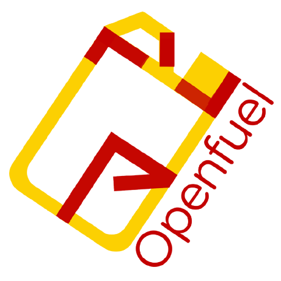

[![Contributors][contributors-shield]][contributors-url]
[![Forks][forks-shield]][forks-url]
[![Stargazers][stars-shield]][stars-url]
[![Issues][issues-shield]][issues-url]
[](https://www.codacy.com/manual/Openfuel/openfuel?utm_source=github.com&amp;utm_medium=referral&amp;utm_content=Openfuel/openfuel&amp;utm_campaign=Badge_Grade)

<!-- PROJECT LOGO -->
<br />
<p align="center">
  <a href="https://github.com/openfuel/openfuel">
    
  </a>

  <h3 align="center">Openfuel</h3>

  <p align="center">
    A platform to connect open-source contributors to startups and organisations who are willing to adopt open-source software!
    <br />
    <a href="https://openfuel.org"><strong>Get started »</strong></a>
    <br />
    <br />
    <a href="https://github.com/openfuel/openfuel/issues">Report Bug</a>
    ·
    <a href="https://github.com/openfuel/openfuel/issues">Submit Feature</a>
  </p>
</p>


<!-- TABLE OF CONTENTS -->
## Table of Contents

* [About the Project](#about-the-project)
  * [Built With](#built-with)
* [Development](#develipment)
  * [Prerequisites](#prerequisites)
  * [Installation](#installation)
* [Roadmap](#roadmap)
* [Contributing](#contributing)
* [License](#license)
* [Contact](#contact)
* [Acknowledgements](#acknowledgements)


<!-- ABOUT THE PROJECT -->
## About The Project
<!-- 
[![Product Name Screen Shot][product-screenshot]](https://example.com)
-->


### Built With
This project would never have been possible without these wonderful frameworks and project.
* [Spruce](https://github.com/dan-divy/spruce)
  Openfuel is a modified version of Spruce!
* [Github-resume](https://resume.github.io/)
  We use github-resume to customize our experience!


<!-- GETTING STARTED -->
## Development

This is an example of how you may give instructions on setting up your project locally.
To get a local copy up and running follow these simple example steps.

### Prerequisites

Clone the repo and hit npm install.
* npm
```sh
npm install
```

### Startup

1. Clone the repo
```sh
git clone https:://github.com/your_username_/Project-Name.git
```
2. Install NPM packages
```sh
npm install
```
3. Start the project
```JS
npm start
```


<!-- ROADMAP -->
## Roadmap

See the [open issues](https://github.com/openfuel/openfuel/issues) for a list of proposed features (and known issues).


<!-- CONTRIBUTING -->
## Contributing

Contributions are what make the open source community such an amazing place to be learn, inspire, and create. Any contributions you make are **greatly appreciated**.

1. Fork the Project
2. Create your Feature Branch (`git checkout -b feature/AmazingFeature`)
3. Commit your Changes (`git commit -m 'Add some AmazingFeature'`)
4. Push to the Branch (`git push origin feature/AmazingFeature`)
5. Open a Pull Request


<!-- LICENSE -->
## License

Distributed under the MIT License. See `LICENSE.md` for more information.


<!-- CONTACT -->
## Contact

- Divy Srivastava - [@undefined_void](https://twitter.com/@undefined_void) - dj.srivastava23@gmail.com

- DanCodes - [dan-online](https://github.com/dan-online) - <dan@dancodes.online>

- Yash Saxena - yash@openfuel.org

Project Link: [https://github.com/openfuel/openfuel](https://github.com/openfuel/openfuel)


[contributors-shield]: https://img.shields.io/github/contributors/openfuel/openfuel?style=flat-square
[contributors-url]: https://github.com/openfuel/openfuel/graphs/contributors
[forks-shield]: https://img.shields.io/github/forks/openfuel/openfuel?style=flat-square
[forks-url]: https://github.com/openfuel/openfuel/network/members
[stars-shield]: https://img.shields.io/github/stars/openfuel/openfuel?style=flat-square
[stars-url]: https://github.com/openfuel/openfuel/stargazers
[issues-shield]: https://img.shields.io/github/issues/openfuel/openfuel?style=flat-square
[issues-url]: https://github.com/openfuel/openfuel/issues
[product-screenshot]: docs/img/screenshot.png
